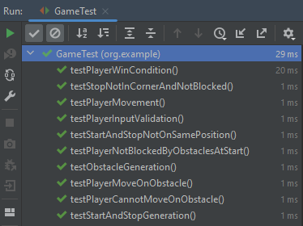

# UWAGA #

### TAU_1 - Laborki 1
Jako TAU Zadanie 1 oddaje z tego projektu przykładowy program z wykorzystaniem wzorca Chain Of Responsibility

Aktualnie uczę się Python-a, na potrzeby w pracy i wykonałem ćwiczenie dodatkowo w Python-ie:
https://github.com/S21242-pj/TAU_1

##### W aktualnym commit-cie, narobiłem błędów, więc na ten moment jest pusty TAU_1, w historii można zobaczyć jak wyglądał, potem go poprawie.
#
### TAU_2 - Laborki 2
W TAU_2 znajduję się projekt używający wzorca projektowego chain of resposibility napisany z użyciem Maven-a, zamiast jak w TAU_1 Gradle-a.

Testy przechodzą 16/16

### TAU_3 - Laborki 3
FirstScenario:
1. Test resetu hasła na https://jbzd.com.pl

SecondScenarios:
1. Test strony https://hearthstone-decks.net/, i wyszukiwania konkrentej tali do gry, od konkretnego gracza.
2. Test strony https://jbzd.com.pl, szukanie najlepszych memów z poczekalni z ostatnich 24h.

### TAU_4 - Laborki 4
1. Zrobione zadanie pierwsze
2. (dla mnie to było opcjonalne, za obecność) - w testach zaznaczone mock vs stub

### TAU_5 - Laborki 5
skip

### TAU_6 - Laborki 6
Gra + Testy, poniżej rezultat wykonania wszystkich testów

